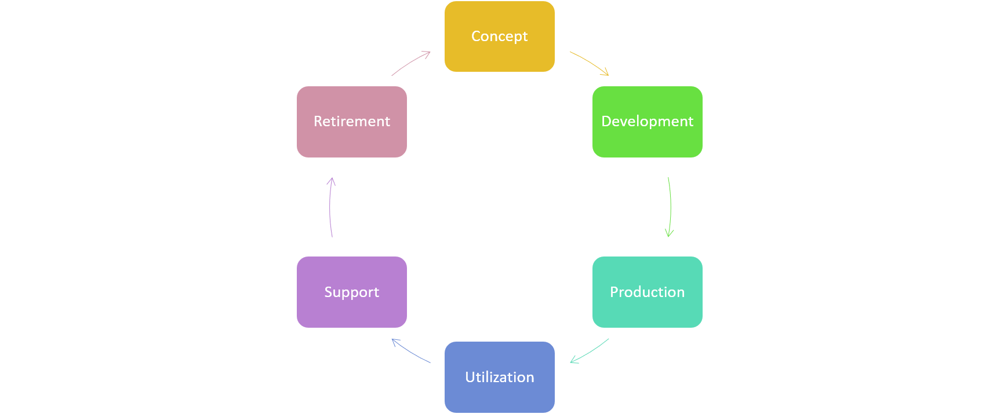
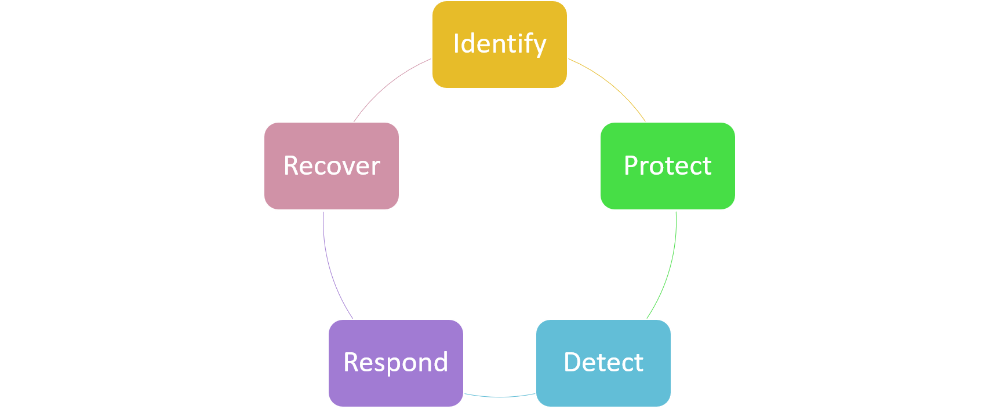
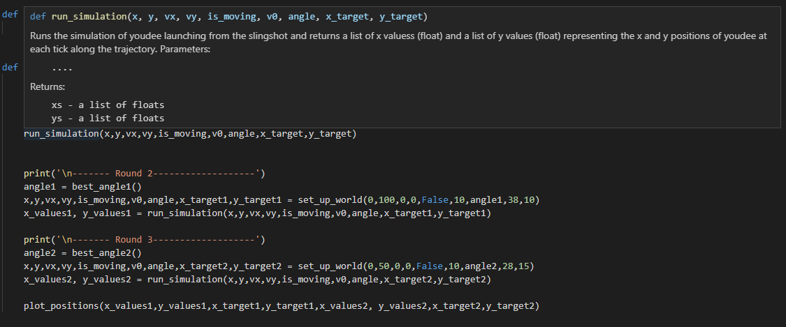

# Coding Best Practices and Standards <!-- omit in toc -->
Table of Contents:

- [Introduction](#introduction)
  - [Quick Overview on SDLC](#quick-overview-on-sdlc)
- [Frameworks](#frameworks)
- [Syntax](#syntax)
- [Versioning Tools](#versioning-tools)
- [Conclusion](#conclusion)
- [References](#references)

## Introduction 
To preface this guide, it's important to understand what best practices are. Generally, best practices are a commonly agreed upon set of guidelines, conventions, ethics, or ideas that represent the most efficient workflow in a given industry [1]. For example, mechanical engineers may follow the practices set by the American Society of Mechanical Engineers while chemical engineers may follow practices set by the American Institute of Chemical Engineers (AIChE) [2]. 

Within software engineering, there is not one governing institute or professional body. The Institute of Electrical and Electronics Engineers (IEEE) is confined to the fields of networking and software architecture as shown in IEEE 802 and IEEE 1471, respectively [3]. On the other hand, the International Organization for Standardization (ISO) has standardized processes in the software development cycle (SDLC) which is in ISO 12207. Due to the versatility of coding, there are many ways to write software. Many engineers utilize a variety of stylistic choices within their syntax. Furthermore, there are other commonly employed tools that help with the SDLC management such as versioning control. 

### Quick Overview on SDLC
For those not familiar with the SDLC, it can be broken down into these parts as per ISO 12207 [4]:

 <!-- Made this myself -->

1. **Concept Stage** - initial research, brainstorming, and feasibility
2. **Development Stage** - technical requirements, software architecture, and prototyping
3. **Production Stage** - code development and testing
4. **Utilization Stage** - deployment and application performance monitoring 
5. **Support Stage** -  maintenance and customer support 
6. **Retirement Stage** - termination of offered services 

It's important to note that not all pieces of software or companies follow these stages word for word. Rather, they may be adapted and loosely utilized. For example, a web application may go through the first five stages, but may continue to iterate back and forth between production, utilization, and support stages. As long this web application is being maintained and updated, then it will not reach the retirement stage. Lastly, different institutions may have varying names for these stages but these stages are most likely followed. 

## Frameworks 
Coding best practices are necessary so that developers can produce safe, secure, and reliable software. These best practices help engineers to work in larger codebases, providing some standard for readability within complex code blocks. Oftentimes, these coding standards can be specific to languages like C or C++, or can vary depending what industry someone may be working at [5].    

Frameworks and standards align with best practices, but they are usually mandatory in industry work. For example, there are a variety of security frameworks that many technology companies follow such as the ISO/IEC 27001 standard, NIST framework, or the MITRE framework. Many places may follow a combination of standards while others hone into a specific one like the ISO standards because they can be certified in a particular field like data privacy. Although security frameworks may not be required, they are often utilized since these frameworks help companies of all scales mitigate possible cybersecurity related issues.

The NIST framework equips engineers with the knowledge of how to incorporate security within the business's infrastructure [6]. It does this by outlining five high level functions: 

 <!-- Made this myself -->

- **Identify** - assessing assets and their associated risks
- **Protect** - implementing protective technologies and mitigating risk
- **Detect** - monitoring of assets and risks
- **Respond** - response during a security incident
- **Recover** - actions the business should take after resolving the incident  

Moreover, the ISO/IEC 27001 generally follows the same five high level functions that are found in the NIST framework [7]. Both NIST and ISO/IEC 27001 are general security frameworks that any software company can utilize. 

At times, industries like the automotive industry have more specific frameworks such as MIRSA C++ so that car companies can focus in software integrity and safety [8]. Similar to NIST, MIRSA C++ incorporates best practices even though it is specific to coding in C++.  

Security frameworks should not be confused with coding frameworks such as Ruby on Rails, Django, Angular, etc. These coding frameworks add another level on top of a programming language to achieve specific tasks like web application development. This helps developers control the development process through a single platform [9]. Additionally, coding frameworks may also force developers to follow best practices and design patterns. 

## Syntax 
Most modern and commonly utilized programming languages have variables, constants, and functions among other things. When writing code, developers follow stylistic coding conventions. Each place of work may define some of their own coding standards, but some are used regardless of setting. Syntax based coding practices allow engineers to have an easier time to integrate their own piece of code into a larger codebase, to improve readability, to decrease unnecessary complexity, to reuse code, to facilitate better debugging capabilities, and to promote productivity [10]. Here's a list of common conventions [10,11]: 

1. **Limiting the use of global variables** <br>
   These variables don't provide access control, meaning that anyone can modify them. They can also be less memory efficient. 
2. **Naming conventions of local and global variables, constants, and functions** <br>
   - All names given to any variable, constant, or function should try to be descriptive
   - Local variables should be in camel case like `localVar` 
   - Global variables should start with a capital letter then follow camel case like `GlobalVar`
   - Constants should be in all capital letters like `CONSTANT`
   - A function's name should be descriptive of what it does like `calculateArea` 
3. **Commenting** <br>
   Comments should be added into complex pieces of code so that other engineers can understand what's happening. Don't get overboard with it though!
4. **Docstrings** <br>
   Many Integrated Development Environments (IDE) have a built in functionality to output a docstring for a specific function. This helps define a function that's being built and helps the people who are using it. In the picture below, the popup displays the docstring.
   
5. **Indentation and formatting** <br>
   Indentation and formatting within code should be the same as the codebase that is being worked on. This helps a lot with readability. 
6. **Stay away from deep nesting** <br>
   If there are many loops within loops or if there are many if statements with if statements, then it is much harder to read what the actual conditions within the block of code. The code block below shows an example what *not* to do.
   ```
   if(name == "person"){
     if(age >= 18){
       if(isGirl){
         if(hasPaintedNails){
           //Do something cool here...
         }
       }
     }
   }
   ```
7. **Code Blocks** <br>
   Code should be in blocks if they are related tasks. For example, if the beginning of a program opens files and manipulates the data afterwards, then separate opening the file to one block of code and put the data manipulation in another. The block of code below demonstrates code blocking where round 2 does specific operations and is grouped together while round 3 does its own set of operations and is grouped together. 
   ```
    print('\n------- Round 2-------------------')
    angle1 = best_angle1()
    x,y,vx,vy,is_moving,v0,angle,x_target1,y_target1 = set_up_world(0,100,0,0,False,10,angle1,38,10)
    x_values1, y_values1 = run_simulation(x,y,vx,vy,is_moving,v0,angle,x_target1,y_target1)
    
    print('\n------- Round 3-------------------')
    angle2 = best_angle2()
    x,y,vx,vy,is_moving,v0,angle,x_target2,y_target2 = set_up_world(0,50,0,0,False,10,angle2,28,15)
    x_values2, y_values2 = run_simulation(x,y,vx,vy,is_moving,v0,angle,x_target2,y_target2)
   ``` 
8. **Short Functions** <br>
   When writing a piece of code that tackle lots of functionality, then utilize helper functions. They make the code more readable and give the option to reuse the helper functions in other parts of the code. The example code below illustrates how a helper function can be used to find the volume of a cylinder.    
   ```
   def calculateBaseArea(radius):
    area = math.pi * (r ** 2)
    return area

   def calculateVolume(radius, height):
    area = calculateBaseArea(radius)
    volume = area * height
    return volume
   ```

## Versioning Tools
Versioning tools like Git, Mercurial (Hg), and Subversion (SVN) help engineers collaborate with each other and control the releases of the product that's being worked on. Git based tools such as GitHub, GitLab, BitBucket, etc. are most commonly used. Engineers are able to work on their own computers and access the files needed to work on the project independently. A versioning tool then integrates the independent work done on the product and merge them together with the team's overall work [12]. Additionally, these tools enable developers to rollback releases to an earlier version, and it gives a point of redundancy so that when an someone's computer (inevitably) breaks, they could easily retrieve the files within the project [13]. Some common terms used in regards to versioning tools are the following: 

- **Repository (Repo)** - a database of changes and the project being worked on 
- **Remote** - specific version of a repo that is hosted on service provider like GitHub or BitBucket
- **Local** - specific version of a repo that is hosted on a personal machine
- **Commit** - edits or revisions made to the repo 
- **Clone** - copies a repo 
- **Push** - publishes a commit so that others can see new revisions
- **Pull** - retrieves commits by other people 
- **Fetch** - downloads contents of a remote repo 
- **Branch** - allows for parallel revisions to be made to the same version 
- **Merge** - combines branches back together

Projects of all scales should use some type of versioning tool so that progress can be tracked and be rolled back if errors occur. These tools also have best practices. While this list is not exhaustive, it provides a great starting point when using tools like Git [12] and [14]:

1. **Descriptive commit messages** <br>
   Make a useful commit message that describes the revisions made to the new commit
2. **Repo ≠ Fileshare** <br>
   Repos should only contain source code files relevant to the project that's being actively worked on. Engineers should not include random files because it makes the repo much bulkier than it needs to be.  
3. **Configure git ignore file** <br>
   Make sure the `.gitignore` file is updated when a new repo is made. This helps keep the repo clean, preventing potential user specific files to end up inside of it. The code snippet below demonstrates how someone would ignore the `__pycache__`, python's bytecode, and a VS Code folder which are all automatically generated. 
   ```
   # VS Code 
   .vscode/
   # Python bytecode and cache
   __pycache__
   *.py[cod]
   ```
4. **Commit often** <br>
   After finishing a single task, make sure a commit is made because this help the versioning tool keep track of each revision. If the code breaks in the future, then these commits can be used to rollback the project's version.
5. **Pull often** <br>
   Keep the project up to date by pulling frequently. This ensures that other teammates' changes are incorporated to the local. 
6. **Push often** <br>
   Similar to points 4 and 5, push often. This aids in updating teammates when new revisions are implemented.  

Unfortunately, there is not a standard for branch management. Generally, branches are utilized to separate utilization stage code from production stage code. This allows for users to operate an application even when developers are working on new features for it. A typical remote repo would consist of two main branches of `master` and `develop` [15]. `master` should contain stable code in the utilization stage while `develop` contains new developer work. As the `develop` branch continues to grow, it will eventually become stable, meaning that `develop` must merge into `master` so users can experience a developer's hard work. Moreover, temporary branches can be created by branching off of `develop` to add in specific features and/or help in stability. These temporary branches eventually will be reintegrated back into `develop` first, then trickle down into `master`. Unlike the feature branches, hotfix branches may branch off of `master` so that developers can fix current issues that end users are experiencing. Below is a picture that illustrates this, and the parallel work that can be achieved by branching [15]. The relationship between `master` and `develop` is only one way to utilize the power of branches and can change depending on a business's size and structure.


## Conclusion
Software engineering does have best practices related to programming and versioning control to improve a developer's readability, documentation, and productivity. Furthermore, companies and enterprises rely on these best practice for security, reliability, and organization no matter what industry they may be involved in. Even without a unified professional body, the community of software engineers work together to solidify certain conventions and practices. 

## References
[1] https://www.investopedia.com/terms/b/best_practices.asp <br>
[2] https://guides.libraries.psu.edu/c.php?g=363372&p=2457486 <br>
[3] https://ieeexplore-ieee-org.udel.idm.oclc.org/document/917550 <br>
[4] https://ieeexplore-ieee-org.udel.idm.oclc.org/stamp/stamp.jsp?tp=&arnumber=8526560 <br>
[5] https://www.perforce.com/blog/qac/9-coding-standards-best-practices <br>
[6] https://www.nist.gov/cyberframework/online-learning/components-framework <br>
[7] https://ictinstitute.nl/iso-27001-requirements-summary/ <br>
[8] https://www.misra.org.uk/misra-cpp/Activities/MISRAC/tabid/171/Default.aspx <br>
[9] https://hackr.io/blog/what-is-frameworks <br>
[10] https://www.geeksforgeeks.org/coding-standards-and-guidelines/ <br>
[11] https://dzone.com/articles/10-tips-how-to-improve-the-readability-of-your-sof <br>
[12] https://homes.cs.washington.edu/~mernst/advice/version-control.html <br>
[13] https://git-scm.com/book/en/v2/Getting-Started-About-Version-Control <br>
[14] https://infocus.delltechnologies.com/joe_pearlman/best-practices-for-scaling-version-control-in-the-large-enterprise/ <br>
[15] https://nvie.com/posts/a-successful-git-branching-model/ <br>
